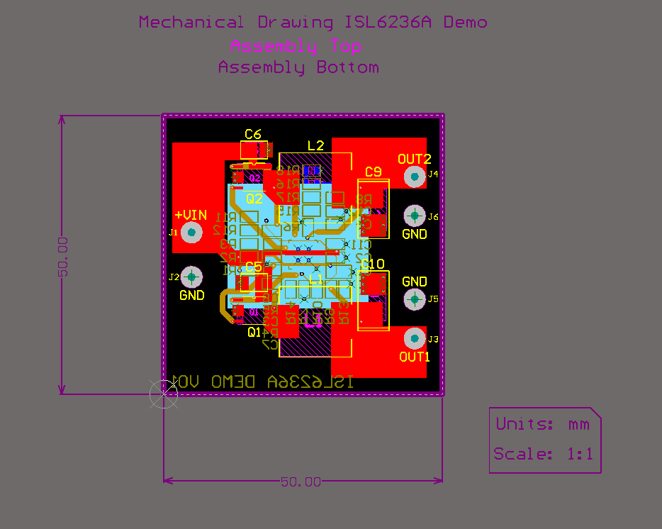

# ISL6236A Demo

### Summary: ###
  This project is one of two courses used to learn Altium Designer. It builds around a DC-DC switch mode chip with two highly adjustable outputs and an adjustable input. You can find the link to this course at [Fedevel Academy](https://academy.fedevel.com/courses/online-switching-power-supply-design-course), and the repository of the other project [here]().

  The schematic PDF, 3D PCB PDF, and gerber files can all be accessed in the _'Outputs/'_ folder. Other mechanical drawings are not included because they add clutter and can be generated from the project itself in Altium.
  
  
